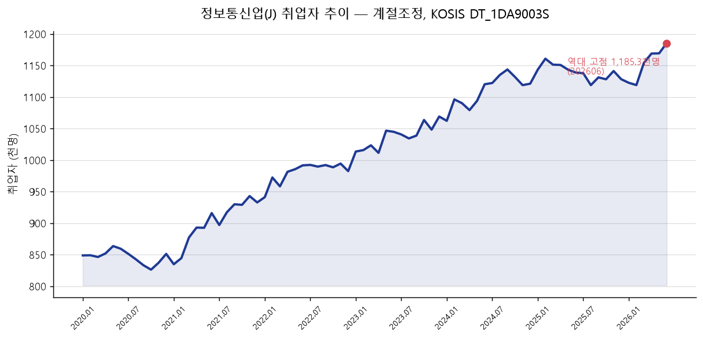
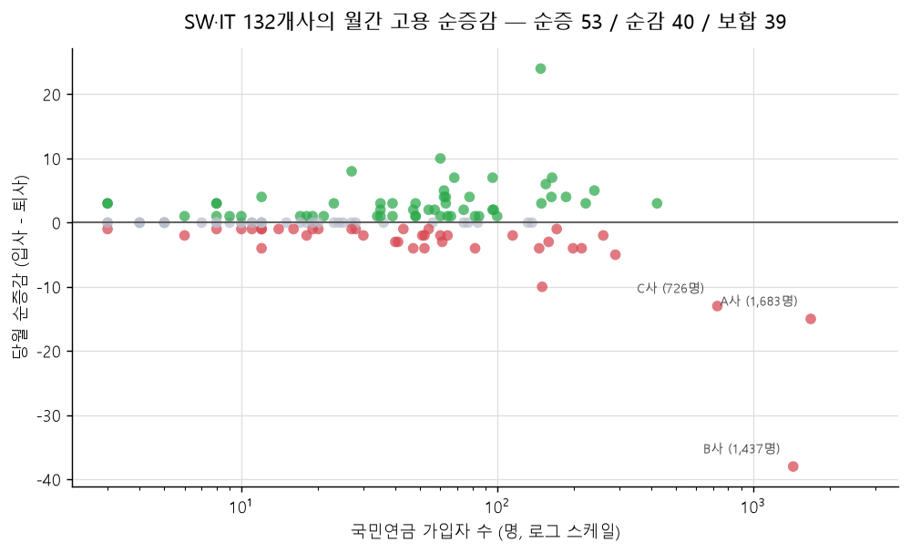
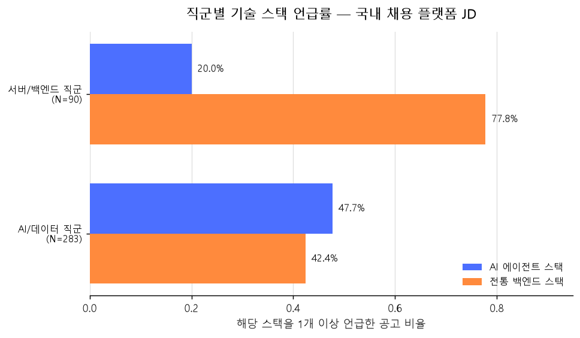
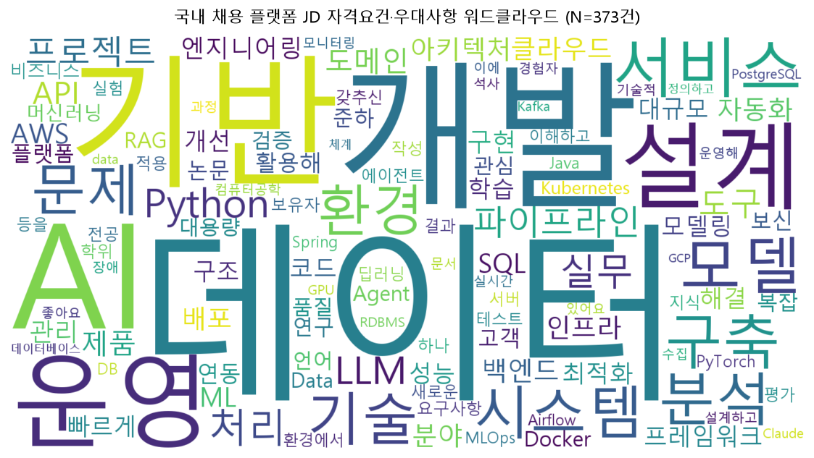
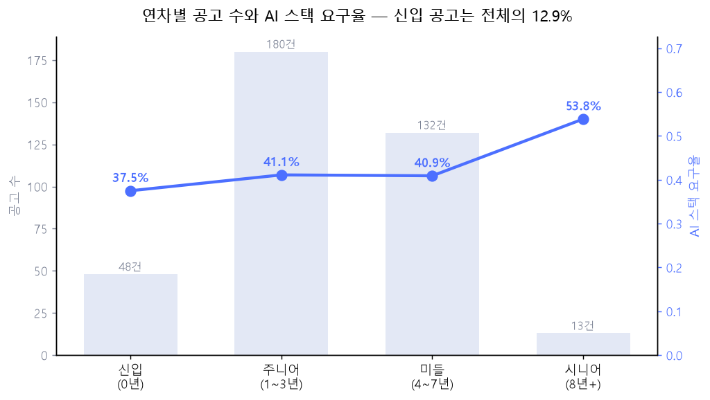

# 02. 국내 채용 시장 분석

> 정형(공공 통계) + 비정형(JD 텍스트) 융합 분석
> 기준일: 2026-08-10 / 모든 수치는 수집 파일에서 계산되며 [data/provenance.json]로 원본까지 역추적 가능

---

## 1. 산업 고용 총량 — KOSIS

**통계표**: `DT_1DA9003S` 산업별 계절조정 취업자 / 1,638행 / 21개 산업 / 2020-01~2026-06 (78개월)

| 지표 | 값 |
| :--- | ---: |
| 2020-01 → 2026-06 | 848.7 → **1,185.3천명 (+39.7%)** |
| 전년동월 대비 | **+46.6천명 (+4.1%)** |
| 전산업 내 비중 | 3.09% → **4.11% (+1.03%p)** |
| 역대 고점 | **2026-06 = 최신월이 곧 고점** |

➔ **"개발자 채용 한파"는 산업 전체 취업자 수준에서 지지되지 않습니다.**

> ⚠️ 이 수치는 **산업(J 정보통신업) 단위**입니다. 영업·기획·운영 등 비개발 직군이 포함돼 있어
> "개발자 고용"과 정확히 같지 않습니다.

---

## 2. 기업 단위 고용 흐름 — 국민연금

채용 공고를 낸 기업 268개를 국민연금 사업장 데이터와 이름 매칭했습니다. **237개 매칭(88.4%)**.

| 구분 | 값 |
| :--- | ---: |
| 소프트웨어·IT 업종 | **132개사** / 총 가입자 11,262명 |
| 당월 입사 / 퇴사 | → **순증감 +18명** |
| 기업별 분포 | 순증 **53개사** / 순감 **40개사** / 보합 39개사 |

➔ **산업 총량은 성장하지만 개별 기업에서는 감원이 동시에 진행 중**입니다.

> ⚠️ 국민연금 기간별 현황 API는 **당월 단일 스냅샷**(2026-06)입니다. 기업별 고용 *추이*가 아니라
> **한 달치 입퇴사 흐름**으로만 해석해야 합니다.

### 기업명 매칭에서 걸러낸 것

채용 플랫폼은 **브랜드명**, 국민연금은 **법인등기명**을 씁니다. 검색 API가 부분 문자열로 매칭하기 때문에
후보 중 아무거나 고르면 오매칭이 납니다. 실제로 나왔던 사례:

* 글로벌 IT 기업 → **상호가 겹치는 건설사** (유리 및 창호 공사업) ❌
* 식품 브랜드 → **같은 상호의 음식점 지점** (일식 음식점업) ❌

정규화 후 **완전 일치만 채택**하도록 바꿨습니다. 매칭률은 100% → 88.4%로 떨어졌지만,
**매칭을 놓치는 편이 틀린 기업을 붙이는 것보다 낫습니다.**

---

## 3. 요구 기술 스택 — JD 텍스트

**정제 이력**: 원본 408건 → 비개발 직군 -14건, 중복 게시 -21건 → **분석 대상 373건**

* 비개발 제거: 한 회사의 `AI Tutor - {언어}` 공고 14건. 언어 데이터 라벨링 직무로 개발 공고가 아님.
* 중복 제거: 동일 회사가 같은 본문 JD를 최대 5건까지 게시. 회사+본문 기준 1건으로 축약.
* 정제 규칙은 [src/job_dataset.py](../src/job_dataset.py)에 **단일 정의**하여 분석과 그래프가 같은 모집단을 사용.

| 직군 | N | AI 에이전트 스택 | 전통 백엔드 스택 |
| :--- | ---: | ---: | ---: |
| AI/데이터 직군 | 283 | **135건 (47.7%)** | 120건 (42.4%) |
| 서버/백엔드 직군 | 90 | 18건 (20.0%) | 70건 (77.8%) |

* AI/데이터 상위 키워드: `LLM` 40.6%, `RAG` 21.9%, `Agent` 14.5%, `프롬프트` 8.8%
* 서버/백엔드 상위 키워드: `AWS` 45.6%, `Spring` 35.6%, `Java` 33.3%, `MySQL` 25.6%

➔ **27.7%p 격차.** 두 직군의 요구 역량이 실제로 갈라져 있습니다.

---

## 4. 🎯 연차별 분석 — 진짜 병목

| 구간 | N | AI 스택 | 전통 스택 | 상위 키워드 |
| :--- | ---: | ---: | ---: | :--- |
| 신입 (0년) | 48 | 37.5% | 43.8% | LLM 31%, Docker 23%, AWS 21% |
| 주니어 (1~3년) | 180 | 41.1% | 48.3% | LLM 35%, AWS 28%, Docker 20% |
| 미들 (4~7년) | 132 | 40.9% | 56.8% | LLM 33%, AWS 31%, Kubernetes 19% |
| 시니어 (8년+) | 13 | 53.8% | 53.8% | LLM 31%, RAG 31%, AWS 31% |

**핵심 수치 두 개**

1. **신입 지원 가능 공고는 48/373건 = 12.9%.**
   시장 총량은 역대 고점인데 진입로는 8분의 1입니다. "시장은 커지는데 나는 힘들다"는 체감의 직접적 근거입니다.

2. **AI 스택 요구율이 연차와 함께 상승** (신입 37.5% → 시니어 53.8%).
   신입에게 AI를 덜 요구한다는 뜻인데, 뒤집으면 **신입이 AI 스택으로 차별화할 여지가 크다**는 의미이기도 합니다.

> ⚠️ 시니어 구간은 **N=13**으로 표본이 작습니다. 53.8%는 7건 기준이므로 단독 인용하지 마세요.

---

## 5. 공공부문 대조군 — 잡알리오

민간 JD의 "신입 12.9%"는 비교 대상이 해외(HN)뿐이었습니다. 그래서 **낮은 이유가
'한국이라서'인지 '민간이라서'인지** 가를 수 없었습니다.

잡알리오(공공기관 채용정보)는 같은 나라·같은 기간의 공공부문 기준선을 줍니다.
공고 시작일이 함께 오므로 **국내 데이터 중 유일하게 시계열이 있습니다.**

**수집**: [src/collect_alio.py](../src/collect_alio.py) — 2020-01-01 이후 **86,635건 / 80개월**, 호출 87회

### 민간과 비교 가능한 형태로 자르기

전체 86,635건의 신입 가능 비중은 92.9%인데, 이 숫자를 민간 12.9%와 나란히 두면 안 됩니다.
비정규직이 57,763건으로 압도적이고 청년인턴이 별도 고용형태로 잡혀 있어서입니다.
NCS 정보통신(`R600020`) × 정규직(`R1010`)으로 좁혔습니다.

| 구분 | 모집단 | 신입 가능 | 비중 | 측정 방식 |
| :--- | ---: | ---: | ---: | :--- |
| 공공 IT·정규직 | 1,678 | 1,486 | **88.6%** | `recrutSe` 코드값 |
| 민간 국내 개발 JD | 373 | 48 | **12.9%** | `annual_from` 구조화 필드 |
| 해외 HN (레벨 명시분) | 18,787 | 1,839 | 9.8% | 자유 텍스트 파싱 |

➔ 같은 나라, 같은 기간인데 **공공 88.6% vs 민간 12.9%.**
   신입 문이 좁은 것은 **한국 노동시장 전반의 성질이 아닙니다.**

> ⚠️ **다만 두 모집단의 직군이 같지 않습니다.** NCS 정보통신은 대분류라 개발과 전산운영을
> 나누지 않습니다. 실제로 정보통신이 붙은 6,971건 중 **77.4%는 다른 대분류(전기·전자,
> 경영·회계·사무, 기계 등)가 함께** 붙어 있고 — 통합 공채에 태그가 하나 얹힌 것입니다 —
> IT×정규직 1,678건으로 좁히면 그 비율이 **93.4%** 로 오히려 올라갑니다.
> 정보통신 단독 공고도 제목을 보면 `전산담당`, `정보보안`, `AMI 유지보수`, `통신시설관리`처럼
> **소프트웨어 개발 공고가 아닌 것**이 많습니다.
>
> 따라서 88.6%는 **"공공 채용 전반의 신입 개방도"** 로 읽어야 하고,
> 민간 "개발 JD" 12.9%와 **같은 직군을 잰 값이 아닙니다.**
> 공공 데이터로 개발 직군만 분리하는 방법은 현재 없습니다.

### 공공 IT·정규직 연도별 — 진입문은 좁아지지 않았다

| 연도 | 2020 | 2021 | 2022 | 2023 | 2024 | 2025 | 2026* |
| :--- | ---: | ---: | ---: | ---: | ---: | ---: | ---: |
| 공고수 | 231 | 254 | 295 | 234 | 255 | 254 | 155 |
| 신입 가능 | 83.1% | 85.8% | 90.5% | 93.6% | 88.2% | 88.6% | 90.3% |

\* 2026년은 수집 시점(08-11)까지의 부분 집계

➔ 공공부문에서는 신입 문이 좁아진 흔적이 없습니다. 다만 위 주의대로 **직군이 다르므로**,
   "민간 개발 직군만 좁아졌다"까지 단정할 수는 없습니다. 말할 수 있는 것은
   **"같은 기간 공공 채용의 신입 개방도는 유지됐다"** 입니다.

### 공고 수는 유지, 채용 인원은 감소

전체(직무 무관) 기준으로 보면 다른 그림이 나옵니다.

| 연도 | 2020 | 2021 | 2022 | 2023 | 2024 | 2025 |
| :--- | ---: | ---: | ---: | ---: | ---: | ---: |
| 공고수 | 13,216 | 13,723 | 14,229 | 12,751 | 12,382 | 12,454 |
| 채용인원 | 140,308 | 111,607 | 112,334 | 97,639 | 98,804 | 115,836 |

공고 수는 -5.8%인데 채용 인원은 **-17.4%** 입니다. **공고 건수만 세면 안 보이는 축소**가
인원에서 드러납니다. 민간 JD에는 채용 인원 필드가 없어 같은 확인을 할 수 없습니다.

> ⚠️ 세 수치(공공/민간/해외)는 **측정 방식이 다릅니다.** %p로 빼서 "격차"라고 부르면 안 됩니다.
> 특히 공공 88.6% 중 신입 단독 공고는 539건(32.1%)뿐이고 나머지는 '신입+경력' 통합 공고인데,
> 민간 데이터에는 이 구분 자체가 없습니다. 정규화로 없앨 수 없는 차이입니다.

> ⚠️ 직무 필터를 걸면 **채용 인원은 상한값**이 됩니다. `recrutNope`은 공고 단위 인원인데
> 한 공고가 여러 직무를 묶어 뽑기 때문입니다(86,635건 중 26,997건이 복수 NCS 코드).
> 필터를 건 비교에는 공고 수를 쓰세요.

재현: [src/compare_entry_level.py](../src/compare_entry_level.py)

---

## 6. 종합

| 층위 | 데이터 | 방향 |
| :--- | :--- | :--- |
| 산업 총량 | KOSIS | 역대 고점, 성장 중 ↑ |
| 기업 단위 | 국민연금 | 순증 53 : 순감 40, 물갈이 ↔ |
| 요구 역량 | JD 텍스트 | AI로 이동, 직군별 분화 → |
| 진입문 (민간) | JD 연차 필드 | 신입 12.9%, 좁음 ↓ |
| 진입문 (공공) | 잡알리오 | 신입 88.6%, 6년간 유지 ↔ (직군 구분 불가) |

**"시장은 커지는데 개인은 힘들다"는 체감이 왜 생기는지가 다섯 층위로 설명됩니다.**
총량 성장 아래에서 기업별 물갈이가 일어나고, 요구 스택이 이동하며, 민간 개발 JD의
신입 진입문은 좁습니다. 같은 기간 공공 채용의 신입 개방도는 유지됐지만,
공공 데이터로는 개발 직군만 분리할 수 없어 직접 대응시키지는 못합니다.

---

## ⚠️ 이 분석의 한계

* **민간 JD는 단면(cross-section)입니다.** 2026년 8월 시점 373건만 있어 "민간에서 스택이 이동했다"는 **시계열 주장은 불가**합니다. 주장 가능한 것은 "직군 간·연차 간 차이가 있다"까지입니다. 국내 시계열은 공공부문(잡알리오)에만 있고, 그것도 신입 비중·채용 인원까지입니다 — **공공 공고에는 기술 스택이 안 적혀 있어 스택 이동은 못 봅니다.** (해외 시계열은 [03](03-global-trend.md) 참조)
* **표본 편향**: AI/데이터 직군을 의도적으로 많이 수집했습니다(283 vs 90). 시장 전체 비율이 아닙니다.
* **기업 표본 한정**: 매칭된 237개사는 **채용 공고를 낸 기업**에 한정되며 산업 전체를 대표하지 않습니다.
* **구인배율은 산출 불가**로 확정됐습니다. 사유는 [01](01-data-source-access.md) 참조.
* **국내는 직군별(프론트엔드·앱·게임 클라이언트) 분해가 안 됩니다.** [03번 6장](03-global-trend.md)의 직군별 그래프가 해외(HN) 기준인 이유입니다. 소스별 한계는 다음과 같습니다.

| 소스 | 직군 정보 | 왜 안 되나 |
| :--- | :--- | :--- |
| 민간 JD 373건 | 2개 카테고리뿐 | 수집 시 `AI/데이터`·`서버/백엔드` 태그만 골랐습니다. 프론트엔드·앱·게임은 **애초에 받지 않았습니다** — 데이터가 없는 게 아니라 범위를 그렇게 잡은 것입니다 |
| 잡알리오 | NCS 대분류까지 | `정보통신` 하나로 개발·전산운영·정보보안·통신설비가 섞입니다. 세부 분류 필드가 상세 조회에도 없습니다 |
| EIS 고용행정통계 | 직종 대분류 10개 | 개발 직군을 분리할 수 없습니다 ([01](01-data-source-access.md)) |
| 워크넷 | 직종 소분류 있음 | 기업회원 전용이라 접근 불가 |

  ➔ 국내 직군별 시계열을 만들려면 **민간 JD를 직군 태그별로 다시 수집**해야 하고,
  그마저도 과거 공고가 없어 단면입니다.
