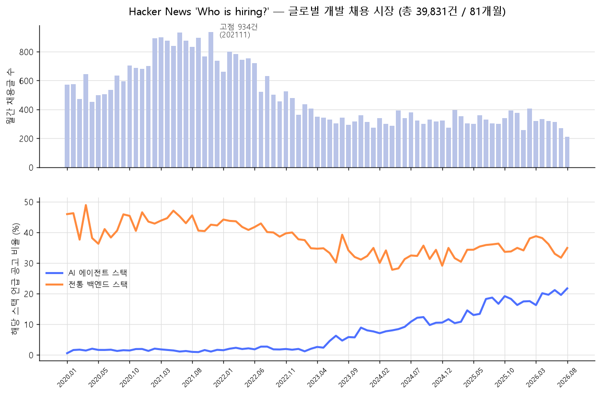
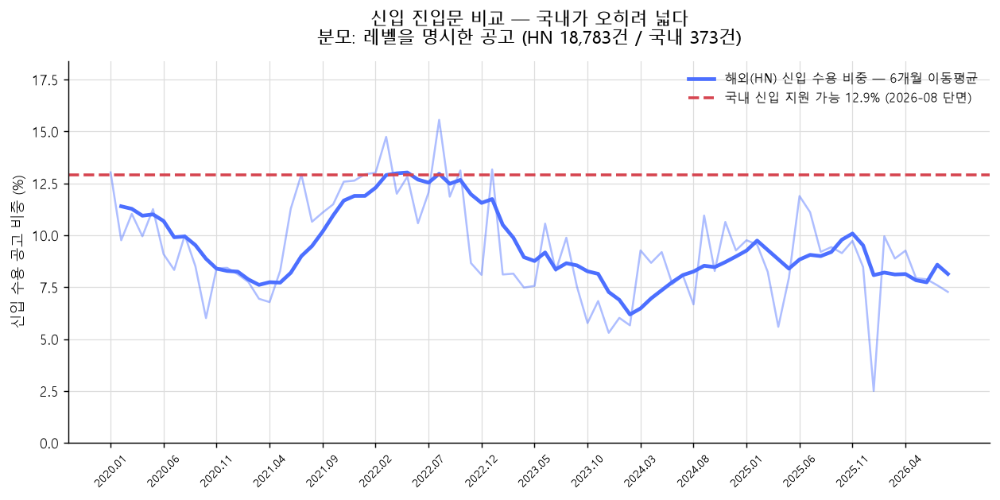
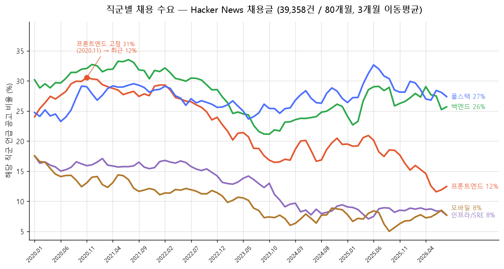

# 🌍 해외 개발 채용 트렌드 분석 (Hacker News, 2020-01 ~ 2026-08)

> **데이터**: Hacker News `Ask HN: Who is hiring?` 월간 스레드
> **규모**: 81개월 / 채용글 **39,831건**
> **수집**: [src/collect_global_hn.py](../src/collect_global_hn.py) — 인증키 불필요
> **원본 추적**: [data/provenance.json](../data/provenance.json)

---

## 왜 이 소스인가

국내 데이터의 가장 큰 공백은 **시계열**이었습니다.

* 국내 채용 플랫폼 JD: 현재 단면만 수집 가능 (과거 공고 조회 불가)
* 워크넷: 기업회원 전용으로 접근 차단
* EIS 고용행정통계: IP 일일 쿼터로 시계열 수집 불가

HN 채용 스레드는 **2011년부터 매달 같은 형식**으로 열려 있어, 동일 기준의 월별 비교가 가능합니다.
"기술 스택이 이동했다"는 주장을 **시간축 위에서** 검증할 수 있는 유일한 소스였습니다.

---

## 1. 채용 물량: 고점 대비 -77%

| 지표 | 값 |
| :--- | ---: |
| 최다 월 | **2021-11, 934건** |
| 최신 월 | 2026-08, **212건** |
| 고점 대비 | **-77.3%** |

**연평균 월간 채용글 수**

| 연도 | 2020 | 2021 | 2022 | 2023 | 2024 | 2025 | 2026 |
| :--- | ---: | ---: | ---: | ---: | ---: | ---: | ---: |
| 월평균 | 581 | **848** | 631 | 346 | 325 | 336 | 304 |

2022년 하반기에 급락한 뒤 **2023년부터 300건대에서 횡보**합니다. 반등이 없습니다.

---

## 2. 기술 스택: AI가 12.7배 증가, 전통 스택은 감소

| 연도 | AI 에이전트 스택 | 전통 백엔드 스택 | LLM 단독 |
| :--- | ---: | ---: | ---: |
| 2020 | 1.5% | 42.8% | 0.0% |
| 2021 | 1.4% | 43.5% | 0.0% |
| 2022 | 2.0% | 41.7% | 0.0% |
| 2023 | 4.3% | 34.5% | 1.4% |
| 2024 | 9.5% | 31.7% | 3.7% |
| 2025 | 15.1% | 34.2% | 6.4% |
| **2026** | **19.0%** | 35.9% | **8.5%** |

* AI 스택 언급률이 **2020년 1.5% → 2026년 19.0%로 12.7배** 증가
* 전통 백엔드 스택은 **42.8% → 35.9%로 감소**
* AI 스택 비율이 10%를 처음 넘은 시점: **2024-07**

➔ **"요구 기술 스택이 AI로 이동했다"는 가설이 시계열로 확인됩니다.** 국내 단면 데이터로는 못 하던 주장입니다.

---

## 3. 🔥 핵심 대비 — 한국과 글로벌이 정반대로 보인다

| 지표 | 한국 (KOSIS 정보통신업) | 글로벌 (HN 채용글) |
| :--- | :--- | :--- |
| 고용/채용 물량 | 2026-06 **역대 고점** (+39.7% vs 2020) | 2021 고점 대비 **-77%** |
| 방향 | 지속 증가 | 2022년 급락 후 횡보 |

**이 모순이 이번 분석의 가장 흥미로운 지점입니다.** 두 수치는 서로 다른 것을 재고 있습니다.

* **KOSIS**는 *산업 전체의 고용 스톡(재직자 수)* 입니다. 정보통신업에 속한 모든 직무(영업·기획·운영 포함)를 세며, 재직자가 유지되면 수치가 유지됩니다.
* **HN**은 *신규 채용 공고 플로우* 입니다. 문이 얼마나 열려 있는지를 봅니다.

➔ **재직자는 늘어도 신규 진입문은 좁아질 수 있습니다.** 국내 데이터에서 확인한
   **신입 공고 비중 12.9%**(48/373건)와 정확히 같은 방향을 가리킵니다.

즉 "시장은 커지는데 나는 취업이 안 된다"는 체감은 착각이 아니라, **스톡은 늘고 플로우는 줄어드는** 구조에서 나옵니다.

---

## 4. 🔬 신입 진입문 직접 비교 — 국내 12.9% vs 해외 7.8%

국내 분석의 핵심 발견은 "신입 지원 가능 공고가 12.9%뿐"이었습니다. 해외도 같은지 확인했습니다.

### 측정 방식이 다르다는 문제부터

| | 국내 JD | HN 채용글 |
| :--- | :--- | :--- |
| 연차 정보 | `annual_from` **구조화 필드** | **자유 텍스트** |
| 값이 있는 비율 | 100% | 레벨 명시 47.7% / 숫자 연차 5.4% |

전체 대비 비율을 그대로 비교하면 HN이 과소 추정됩니다. **레벨을 명시한 공고만 분모로 삼아** 정규화했습니다.

### 결과

| 연도 | 공고수 | 레벨 명시 | 신입 수용 비중 | 시니어 전용 |
| :--- | ---: | ---: | ---: | ---: |
| 2020 | 7,081 | 3,203 | 9.4% | 90.6% |
| 2021 | 10,178 | 4,920 | 10.1% | 89.9% |
| 2022 | 7,575 | 3,648 | **12.3%** | 87.7% |
| 2023 | 4,149 | 1,918 | 8.2% | 91.8% |
| 2024 | 3,899 | 1,858 | 8.3% | 91.7% |
| 2025 | 4,025 | 2,004 | 9.2% | 90.8% |
| **2026** | 2,430 | 1,232 | **7.8%** | **92.2%** |

* **해외 신입 수용 비중은 2022년 12.3%를 정점으로 2026년 7.8%까지 하락**했습니다.
* 명시된 최소 요구 연차의 **중앙값은 4년**(2,105건 기준). 3년 435건, 5년 540건에 몰려 있습니다.
* **국내 12.9% > 해외 7.8%** — 신입 진입문은 **한국이 오히려 넓습니다.**

### 이 결과를 어떻게 읽어야 하나

반직관적이지만 몇 가지 요인이 섞여 있습니다.

1. **국내 채용 플랫폼은 연차 필드가 필수**라 "경력 무관"으로 열어두는 관행이 있습니다. 실제 서류 통과율과는 다릅니다.
2. **HN 표본은 스타트업·원격 중심**입니다. 소규모 팀일수록 즉시 전력을 원해 시니어 편중이 강합니다.
3. 따라서 **"한국이 신입에게 더 관대하다"기보다 "공고에 적히는 방식이 다르다"** 로 읽는 편이 안전합니다.

다만 **추세의 방향은 분명합니다.** 해외는 2022년 이후 신입 문이 계속 좁아졌고, 시니어 전용 공고가 92%를 넘었습니다.

---

## 5. 스택 교차 검증

| 항목 | 한국 (JD, N=373) | 글로벌 (HN, 2026년) |
| :--- | ---: | ---: |
| AI 스택 언급률 | 47.7% (AI/데이터 직군) / 20.0% (백엔드) | 19.0% (전체 직군 혼합) |
| 전통 스택 언급률 | 42.4% / 77.8% | 35.9% |

직접 비교는 조심해야 합니다 — 국내 표본은 **AI/데이터 직군을 의도적으로 많이 수집**했고, HN은 직군 구분이 없는 혼합 표본입니다. 다만 **백엔드 직군 20.0% vs 글로벌 혼합 19.0%** 는 근접해, 한국이 글로벌 대비 특별히 뒤처지거나 앞서 있지는 않음을 시사합니다.

---

## 6. 직군별 수요 변화 — 하락은 고르지 않았다

앞의 1~5장은 전체 공고를 한 덩어리로 봤습니다. 직군을 갈라 보면 **-77%가 고르게
일어난 것이 아니라는 것**이 드러납니다.

**재현**: [src/analyze_role_demand.py](../src/analyze_role_demand.py) — HN 원본 재분석 (80개월 / 39,358건)

### 2020 → 2025

전체 공고가 -43%인 구간이라 절대 건수만 보면 전 직군이 줄어 아무 구분이 안 됩니다.
**시장 대비**(비중의 상대 변화)를 같이 봐야 합니다. 시장이 반토막이어도 비중을 지켰으면 0%입니다.

| 직군 | 절대증감 | 비중 2020 → 2025 | 시장 대비 |
| :--- | ---: | :--- | ---: |
| 풀스택 | -36% | 26.2% → 29.6% | **+13%** |
| ML/AI | -39% | 11.2% → 12.0% | +8% |
| 백엔드 | -51% | 31.0% → 26.9% | -13% |
| 데이터 | -61% | 10.1% → 7.0% | -31% |
| 게임 | -64% | 0.6% → 0.4% | -36% |
| 프론트엔드 | -64% | 28.7% → 18.4% | **-36%** |
| 인프라/SRE | -70% | 16.1% → 8.4% | **-48%** |
| 모바일 | -73% | 14.5% → 6.8% | **-53%** |

* **프론트엔드는 고점(2020-11, 31%) 대비 최근 12%** 로 3분의 1이 됐습니다.
  같은 기간 백엔드는 -13%에 그쳐, 2026년에는 백엔드(27%)가 프론트엔드(13%)의 두 배입니다.
* **가장 많이 빠진 것은 모바일(-53%)** 입니다. 프론트엔드보다 심합니다.
* **유일하게 늘어난 것은 풀스택(+13%)** 입니다. 프론트엔드 감소분의 일부는 소멸이 아니라
  **풀스택으로 흡수**된 것으로 보입니다. 전담 채용이 줄고 한 사람이 둘 다 하는 쪽으로 갔습니다.
* "서버 쪽은 괜찮다"는 통념은 **절반만 맞습니다.** 백엔드는 버텼지만 인프라/SRE는 -48%로
  프론트엔드보다 더 빠졌습니다.

### 이 표에서 두 줄은 읽지 마세요

같은 직군을 **좁은 사전**(역할명만)과 **넓은 사전**(대표 스택 포함)으로 두 번 재서
결론이 사전 선택에 끌려가는지 검사했습니다.

| 직군 | 좁은 사전 | 넓은 사전 | 판정 |
| :--- | ---: | ---: | :--- |
| 인프라/SRE | -48% | -12% | △ 폭 차이 큼 |
| ML/AI | +8% | +166% | △ 폭 차이 큼 |
| 나머지 6개 | | | 일치 |

`infrastructure` 를 넣고 빼는 것만으로 인프라 직군의 감소폭이 4배 갈립니다.
ML/AI는 `\bAI\b` 를 넣는 순간 회사 소개글까지 걸려 +166%가 됩니다.

➔ 이 두 직군은 **"줄었다/늘었다"까지만** 말할 수 있고 **몇 %인지는 말하면 안 됩니다.**
   스크립트가 이 판정을 매번 자동으로 출력합니다.

### 원인은 이 데이터로 말할 수 없습니다

프론트엔드·모바일이 더 줄어든 것은 사실이지만, **원인이 AI인지는 공고 데이터에 찍혀 있지
않습니다.** 같은 기간 금리 인상·투자 위축·리모트 축소가 동시에 일어났고, 수집분에는 이를
분리할 변수가 없습니다. 말할 수 있는 것은 **"프론트엔드·모바일·인프라 수요가 시장 평균보다
빠르게 줄었고 백엔드·풀스택은 상대적으로 버텼다"** 까지입니다.

---

## 7. 기업 채용 보드 교차 검증 — Greenhouse

HN 표본이 스타트업·원격·미국 중심이라는 한계를 보완하기 위해, 기업이 자기 채용 페이지에
쓰는 ATS(Greenhouse)의 공개 API로 JD 원문을 받았습니다. **인증키가 필요 없습니다.**

**수집**: [src/collect_greenhouse.py](../src/collect_greenhouse.py) — 검증된 보드 31개 / 개발 직군 **2,860건**

| 구분 | 값 |
| :--- | ---: |
| AI 스택 언급 | 1,240건 (43.4%) |
| 전통 스택 언급 | 1,468건 (51.3%) |

직무명 기준 직군 분포(한 공고가 여러 직군에 잡힐 수 있어 합계는 100%를 넘습니다):

| 직군 | ML/AI | 데이터 | 보안 | 백엔드 | 인프라 | 풀스택 | 모바일 | 프론트엔드 |
| :--- | ---: | ---: | ---: | ---: | ---: | ---: | ---: | ---: |
| 비중 | 14.0% | 10.4% | 7.5% | 6.0% | 5.6% | 3.3% | 1.6% | **1.1%** |

프론트엔드 전담 직무가 1.1%까지 내려간 것은 HN에서 본 방향과 같습니다.

> ⚠️ **이 수집분으로 시계열을 만들면 안 됩니다.** `first_published` 필드가 있어 월별 집계가
> 가능해 보이지만, 응답에는 **현재 열려 있는 공고만** 들어옵니다. 마감된 공고는 사라지므로
> 과거로 갈수록 표본이 줄어드는 생존 편향이 생깁니다. 시계열은 HN 쪽만 유효합니다.

### 게임 클라이언트는 확인하지 못했습니다

"게임 클라이언트 수요가 급감했다"를 확인하려 게임사 보드 5곳(riotgames·epicgames·roblox·
scopely·krafton, 개발 직군 366건)을 따로 받았습니다. 결과는 **판정 불가**입니다.

| 구분 | 클라이언트 | 서버 | 판정 불가 |
| :--- | ---: | ---: | ---: |
| 건수 | 58 (15.8%) | 26 (7.1%) | **282 (77.0%)** |

* 게임사는 직무명에 계층 대신 프로덕트명을 씁니다 — `Principal Software Engineer, Gameplay
  - Teamfight Tactics` 같은 식이라, 77%가 `Software Engineer` 수준에서 멈춥니다.
* 판정된 것만 보면 클라이언트:서버 = 2.2:1 이지만, 이건 **현재 열린 공고의 단면**입니다.
* HN 쪽 게임 언급은 연 16~92건이라 여기서 클라이언트/서버로 또 가르면 한 자릿수가 됩니다.
* KOSIS에 「게임산업 직무별 종사자 현황」(`DT_113_STBL_1025657`)이 있어 호출해봤으나
  **2012년 단년 데이터**였습니다. 제목의 "연도별"과 달리 시계열이 아닙니다.

➔ **현재 수집 가능한 소스로는 확인도 반박도 못 합니다.** 체감이 맞을 수는 있지만,
   이 저장소 원칙대로 "확인 못 했다"로 남깁니다.

---

## ⚠️ 한계 (발표 시 선제 고지 권장)

1. **HN 채용글 감소가 곧 글로벌 채용 감소는 아닙니다.** HN 자체 트래픽 변화, 채용 채널의 이동(LinkedIn·전문 보드), 커뮤니티 규범 변화가 섞여 있습니다. **방향성 지표**로만 써야 합니다.
2. **표본 편향**: HN은 스타트업·원격근무·미국 중심입니다. 글로벌 전체를 대표하지 않습니다.
3. **키워드 매칭 한계**: `Agent`는 "AI Agent" 외에 "user agent", "agent-based" 등에도 매칭될 수 있습니다. 단어 경계는 적용했으나 의미 구분은 하지 않았습니다.
4. **직군 분류는 키워드 추정입니다.** HN 공고에는 직군 태그가 없어 본문 키워드로 갈랐습니다(6장). 사전에 따라 폭이 갈리는 직군은 표에 표시했습니다.
5. **본문 집계와 원본 재분석의 모집단이 다릅니다.** 1~5장은 수집 당시 CSV(81행 / 39,831건), 6장은 원본 JSON 재분석(80개월 / 39,358건) 기준입니다. **2020-03에 채용 스레드가 두 개 열린 것**이 원인으로, 당시 코드가 스레드마다 행을 만들어 그 달이 두 번 세어졌습니다. 원본은 월을 키로 덮어써서 473건이 유실됐습니다. 수집 코드는 월 단위로 합치도록 고쳤고([04-lessons.md](04-lessons.md) 참조), **재수집 전까지 1~5장 수치에는 2020-03 중복이 남아 있습니다.**

---

## 📌 정리

1. **문제 정의**: "채용 한파"(총량 감소)가 아니라 **"진입문 축소 + 요구 역량 이동"**. 한국·글로벌 양쪽 데이터가 같은 방향입니다.
2. **AI 스택 이동은 시계열로 확인됩니다.** 6년간 12.7배, 아직 상승 중.
3. **하락은 직군별로 고르지 않습니다.** 프론트엔드·모바일·인프라가 시장 평균보다 빠르게 줄었고, 백엔드·풀스택은 버텼습니다. 다만 **원인을 AI로 지목할 근거는 이 데이터에 없습니다.**
